<div align="center">



<a href="https://github.com/tejasabhale"></a>&nbsp;
<a href="https://www.linkedin.com/in/tejas-abhale-50743128a/"></a>&nbsp;
<a href="https://x.com/Tejas55451"></a>&nbsp;
<a href="mailto:abhaletejas4@gmail.com"></a>&nbsp;


</div>

<br/>

<h3><code>tejas@github:~$ cat ./about.md</code></h3>

I'm an **Artificial Intelligence & Data Science undergraduate** who enjoys building things from the ground up — from REST APIs and authentication systems to ML workflows, AI applications, and production-ready web products.

I'm particularly interested in the intersection of **software engineering and AI**: building systems that are useful outside a notebook, exposing them through clean APIs, connecting them to real interfaces, and understanding what happens when they meet real users.

Currently exploring **Machine Learning, NLP, MLOps, Generative AI, and agentic systems**, while continuing to strengthen my foundations in **DSA, backend engineering, databases, and system design**.

<br/>

<h3><code>tejas@github:~$ ./experience --list</code></h3>

<table>
<tr>
<td width="32%"><b>Full Stack Developer Intern</b><br/><sub>Sproug Hub Foundation · Pune</sub></td>
<td width="18%"><sub><code>Jul 2026 — present</code></sub></td>
<td>Working as a Full Stack Developer Intern, contributing to the development of web applications and platform features.</td>
</tr>

<tr>
<td><b>Tech / Development</b><br/><sub>Devkraft Club</sub></td>
<td><sub><code>Aug 2026 — present</code></sub></td>
<td>Working on software projects and contributing to the technical development of applications and club initiatives.</td>
</tr>

<tr>
<td><b>AI & ML Development</b><br/><sub>Independent / Academic</sub></td>
<td><sub><code>2025 — present</code></sub></td>
<td>Building practical ML and AI projects while exploring NLP, LLM applications, MLOps, and modern AI workflows.</td>
</tr>

<tr>
<td><b>Full-Stack Development</b><br/><sub>Independent Projects</sub></td>
<td><sub><code>2022 — present</code></sub></td>
<td>Developing production-oriented applications using React, Node.js, Express, MongoDB, REST APIs, authentication, and modern frontend tooling.</td>
</tr>
</table>

<br/>

<h3><code>tejas@github:~$ ls ./projects/</code></h3>

<table>

<tr>

<td width="50%" height="300" valign="top">

### 📚 Jhep

`React` `Vite` `Node.js` `Express` `MongoDB` `Tailwind CSS`

**🔗 [Live Demo](https://project-jhep.vercel.app/)**

<ul>
<li>English learning platform for rural students in Grades 1–10.</li>
<li>Bilingual Marathi support with lessons, activities, quizzes, and pronunciation guidance.</li>
<li>Progress-focused learning with multimedia content and school management features.</li>
<li>Built with React, Vite, Node.js, Express, MongoDB, and Tailwind CSS.</li>
</ul>
</td>

<td width="50%" height="300" valign="top">

### 📋 TaskFlow

`React` `Vite` `Node.js` `Express` `MongoDB` `JWT`

<ul>
<li>Productivity and project-management platform for organizing work and tracking progress.</li>
<li>Supports workspaces, projects, tasks, members, notifications, and user management.</li>
<li>Secure authentication with JWT tokens, HTTP-only cookies, OTP verification, and password reset.</li>
<li>Built with React, Vite, Node.js, Express, MongoDB, and JWT.</li>
</ul>
</td>

</tr>

<tr>

<td width="50%" height="300" valign="top">

### 🎟️ Event Booking Website

`React.js` `Node.js` `Express.js` `MongoDB` `JWT`

<ul>
<li>Full-stack platform for event discovery, registration, authentication, and ticket booking.</li>
<li>Includes OTP email verification, protected REST APIs, and organizer management workflows.</li>
<li>Provides booking, seat availability, event management, and MongoDB data modeling.</li>
<li>Built with React, Vite, Tailwind CSS, Node.js, Express, MongoDB, and JWT.</li>
</ul>
</td>

<td width="50%" height="300" valign="top">

### 🌱 Krishi Link

`React` `Node.js` `Express` `MongoDB`

<ul>
<li>Agriculture-focused platform concept connecting farmers, buyers, and logistics services.</li>
<li>Explores product discovery, collection hubs, transportation, and agricultural supply workflows.</li>
<li>Designed to address practical challenges in agricultural product movement and coordination.</li>
<li>Built with React, Node.js, Express, and MongoDB as a real-world solution concept.</li>
</ul>
</td>

</tr>

</table>

<br/>

<h3><code>tejas@github:~$ cat ./stack.txt</code></h3>

<table>

<tr>
<td><b>AI / ML</b></td>
<td>


</td>
</tr>

<tr>
<td><b>Backend</b></td>
<td>


</td>
</tr>

<tr>
<td><b>Frontend</b></td>
<td>


</td>
</tr>

<tr>
<td><b>Databases</b></td>
<td>


</td>
</tr>

<tr>
<td><b>Tools / DevOps</b></td>
<td>


</td>
</tr>

</table>

<br/>

<h3><code>tejas@github:~$ ./currently-learning</code></h3>

```text
[+] Machine Learning        [+] MLOps

[+] NLP                     [+] DSA

[+] Generative AI           [+] Backend Engineering

[+] RAG & LLM Applications  [+] System Design
```

<br/>

<h3><code>tejas@github:~$ ./achievements --verify</code></h3>

```text
[✓] B.E. Artificial Intelligence & Data Science

    Dr. D. Y. Patil Institute of Technology · 2025 – 2029

    Current CGPA: 9.59

[✓] Active contributor / developer in technical projects

    Full-stack development · AI/ML exploration · Open-source development

[✓] Built and deployed full-stack applications

    React · Node.js · Express · MongoDB · REST APIs

[✓] Solved DSA problems while following structured preparation

    Algorithms · Data Structures · Problem Solving

[✓] Working toward practical Machine Learning & AI engineering

    ML · NLP · Generative AI · MLOps
```

<br/>

<h3><code>tejas@github:~$ ./connect --now</code></h3>

<div align="center">

<a href="https://github.com/tejasabhale"></a>&nbsp;
<a href="https://www.linkedin.com/in/tejas-abhale-50743128a/"></a>&nbsp;
<a href="https://x.com/Tejas55451"></a>&nbsp;
<a href="mailto:abhaletejas4@gmail.com"></a>

<br/><br/>

<h3><i>
Talk is cheap, show me the code!
</i></h3>

<br/><br/>


</div>
